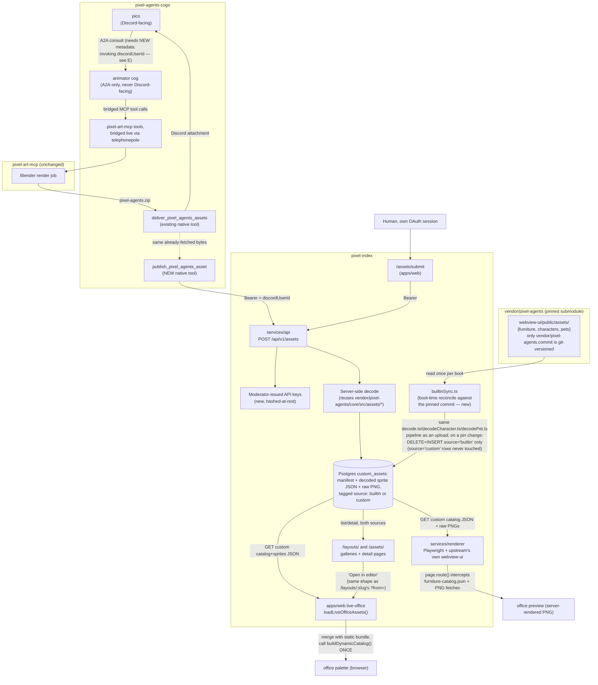

# Custom (uploadable) assets

Pixel Index lets the community — and an automated "animator agent" on the Discord bot
side — publish custom furniture, character, and pet assets, not just office layouts,
through a self-service API. This document is the design record for that feature
(#101, #105, #107/#108): the architecture as decided, what actually shipped in this
repo, and where it diverges from the original plan. It also opens the next piece of
work: showing the *bundled* (built-in) Pixel Agents catalog in the same gallery — see
[Extending the gallery to built-in assets](#extending-the-gallery-to-built-in-assets)
below, which is an investigation with options, not yet decided.

## Status

**Complete in this repo** (`pixel-index`): upload API, moderator-issued API-key auth,
server-side decode pipeline, browser-client merge, renderer integration, the
`/assets/` gallery, and the producer-side JSON Schema contract. Landed across three
PRs: #104 ("stage 1" — storage + web upload), #106 (#105 — characters and pets,
polymorphic `custom_assets`), #108 (#107 — published JSON Schema contract).

**Not in this repo, tracked separately**: the `animator` cog's `publish_pixel_agents_asset`
native tool and the generalized "requesting user" A2A context plumbing (section E below)
live in `pixel-agents-cogs`. `pixel-art-mcp` needs no changes (confirmed pure-generate).
Pre-publish preview rendering for `/assets/submit` (animated/multi-orientation) is
deliberately out of scope — split out to #102, which depends on this work and stays
unspecified until it ships. Issue #101 itself stays open until the cross-repo bot-side
work lands.

Four repos are in scope for the feature as a whole:

| Repo | Role | Outcome |
|---|---|---|
| `pixel-index` | This repo | Upload API, API-key auth, decode pipeline, browser-client merge, renderer integration — **done** |
| `pixel-agents-cogs` | Discord bot cogs (Pico) | New native tool on the `animator` cog, A2A metadata plumbing — **tracked separately** |
| `pixel-art-mcp` | Local Blender→sprite generator | No changes — confirmed to stay a pure local generator |
| `pixel-agents` | Upstream engine/extension (`vendor/`) | Read-only reference — nothing here changes it |

## Decisions made (by the repo owner)

1. The `animator` agent already exists at `pixel-agents-cogs/animator` — A2A-only,
   never Discord-user-facing directly; `pico` consults it. It gains one new native
   tool, `publish_pixel_agents_asset`, reusing the same `pixel-agents.zip` bytes its
   existing `deliver_pixel_agents_assets` tool already downloads — no new
   `pixel-art-mcp` call.
2. Pixel Index needs an API-key concept for machine callers. Only Moderators may
   create a key. Web uploads attribute to the authenticated web user; bot-originated
   uploads attribute to the Discord user who invoked the generation.
3. `pixel-art-mcp` stays pure-generate. No publish capability added there — a
   different threat model (trusted local code execution vs. a public, multi-tenant
   service) and no existing concept of Discord identity/capability to attribute or
   gate an upload by.
4. Upload access = Discord guild membership, nothing more. Anyone in the server can
   upload a custom asset. Whether the animator agent itself can be invoked is a
   separate, already-solved gate outside Pixel Index's permission model.
5. No moderator pre-publish review step. A valid upload goes live immediately.
6. The "requesting user" A2A context is generalized, not animator-only — every
   agent's tools will eventually see who asked.
7. Asset-id collisions never reject — they auto-suffix (`_2`, `_3`, ... first free
   integer suffix), uniformly against a built-in id or another custom asset's id. The
   upload response returns the actually-assigned id.
8. "Ghost" user records are acceptable: a bot-attributed upload may briefly be
   authored by a Discord ID with no visible Pixel Index profile, reconciled later by
   the existing login-time profile upsert if that person logs in themselves.
9. New web routes: `/` redirects to `/layouts/` (the gallery, moved there); `/assets/`
   is the new custom-asset gallery, mirroring the layout routes' shape end to end
   (list → detail → editor).
10. `/assets/submit` needs a pre-publish preview eventually, but building it is
    substantial (real engine-quality rendering for animated/multi-orientation assets)
    and is split out to #102. This issue's `/assets/submit` ships upload + validation
    only.

## End-to-end architecture

*(The `pixel-agents-cogs`/`pixel-art-mcp` half and everything under `Index` except
`BuiltinSync`/`Vendor` reproduce issue #101's own architecture diagram verbatim — the
`pixel-agents-cogs` half is aspirational/tracked-elsewhere, the rest is implemented in
this repo, see below. `Vendor`, `BuiltinSync`, and the edges into/out of them are new,
added here for the built-in-asset gallery design decided in
[Extending the gallery to built-in assets](#extending-the-gallery-to-built-in-assets)
below — not part of #101 itself.)*

## As built, in this repo

### `services/api/src/assets/` — upload, decode, storage

- `routes.ts`, `submit.ts`, `schemas.ts`, `serialize.ts`, `query.ts`, `manifest.ts`,
  `decode.ts`, `decodeCharacter.ts`, `decodePet.ts`, `zip.ts`, `spritePng.ts` — a
  parallel module to `layouts/`, same ordering discipline (auth → cheap validation →
  expensive decode → dedupe/auto-suffix → persist).
- **One divergence from the issue's plan worth recording**: D recommended decoding by
  reusing `vendor/pixel-agents/core/src/assets/{build.ts,loader.ts}` directly. The
  actual implementation keeps a **hand-kept local copy** of the manifest schema and
  its own PNG decoder (`zip.ts`, via `pngjs`) instead — `services/api`'s
  `tsconfig.build.json` pins `rootDir: "src"`, so a static import reaching into the
  vendor submodule fails the build, the same constraint `packages/layout-core/src/upstream.ts`
  already works around for furniture-catalog validation. The local copy is also
  **stricter** than upstream's own decoder: upstream's `pngToSpriteData` only warns
  and silently misreads the buffer on a dimension mismatch, which is not the right
  default for an untrusted upload — this repo's copy rejects it.
- `custom_assets` is one polymorphic table (`assetKind: furniture | character | pet`,
  #105), manifest + decoded sprite JSON stored as `jsonb`, the original zip kept
  verbatim in `raw_zip` for provenance/future re-decode.
- Collision handling implements decision #7 exactly: `firstFreeId()` in `zip.ts`,
  checked against both `knownFurnitureIds()` (the pinned built-in catalog, from
  `@pixel-index/layout-core`) and existing custom assets.
- `services/api/src/apiKeys/` implements decision #2's machine-auth path: modeled on
  `auth/tokens.ts`'s opaque-hash primitive, not `webhooks/secret.ts`'s
  encrypt/decrypt one — a key is shown once at creation, stored hashed, moderator-gated
  to issue (`requireCapability`), same precedent as webhook subscriptions.
- `docs/custom-asset-zip-contract.md` (#107/#108) publishes the furniture/pet manifest
  JSON Schemas as the producer-side contract for pixel-art-mcp, generated from the same
  `ajv` schemas `manifest.ts`/`decodePet.ts` actually validate against at upload time
  (`services/api/src/assets/customAssetContract.test.ts` keeps this from drifting), and
  served live at `GET /api/v1/assets/schema/:kind`.

### `apps/web/src/live-office/assets.ts` — browser-client merge (B)

`loadLiveOfficeAssets()` fetches the custom-asset catalog (`GET /api/v1/assets/catalog`)
alongside the existing build-time static bundle, merges the `catalog` arrays and
`sprites` records into **one** `LoadedAssetData`, and calls upstream's
`buildDynamicCatalog()` exactly once — verified necessary because upstream's function
replaces its module-level state on each call rather than accumulating it.

### `services/renderer/src/render.ts` — network-level interception (C)

Implements the recommendation, not the rejected filesystem-materialization
alternative: `page.route()` intercepts `assets/furniture-catalog.json` (appends custom
entries) and per-asset PNG fetches, scoped to that render's `page`, torn down in
`render.ts`'s existing `finally` block — no disk writes, no risk of two concurrent
renders racing over a shared directory in the one Vite dev server this service boots
once and reuses for every request. #105 extended the same pattern for character and
pet sprite fetches.

### `apps/web` routes (G)

`/` → `/layouts/` redirect; `/assets/` (`AssetsGallery.tsx`), `/assets/:id`
(`AssetDetailPage.tsx`), `/assets/submit` (`AssetSubmitPage.tsx`) mirror the layout
routes' list → detail → editor shape exactly as decided. The editor's palette needs no
per-asset loading mode — every published custom asset is already in the merged catalog
from B on every editor session, so "open in editor" from `/assets/:id` is a plain link,
same shape as the layout detail page's own `?from=`.

## Extending the gallery to built-in assets

**Decided — this is the second goal, not yet implemented.**

Today, `/assets/` (`AssetsGallery.tsx`) only lists rows from `custom_assets` via
`GET /api/v1/assets` — every asset a human or the animator has uploaded. It shows
nothing from the ~24 furniture items, 6 characters, and 2 pets **bundled with the
pinned Pixel Agents webview itself** (`vendor/pixel-agents/webview-ui/public/assets/`).
Those already have three separate consumers in this codebase today, each reading the
pinned local checkout directly, none reaching the network for it:

1. **`apps/web/build/liveOfficeAssets.ts`** (Vite plugin) — decodes the full built-in
   catalog (furniture, characters, floors, walls, carpets, pets) **at web-app build
   time**, using `vendor/pixel-agents/core/src/assets/{build,loader,pngDecoder}.ts`
   directly (importable here because `apps/web`'s build script isn't bound by
   `services/api`'s `rootDir: "src"` constraint). Output is written under a
   commit-pinned URL (`assets/pixel-agents/<commit>/...`) so CDN caching never serves a
   stale file after a vendor bump — the pin is part of every URL.
2. **`packages/layout-core/src/upstream.ts`**'s `furnitureCatalog()` — reads
   `assets/furniture/*/manifest.json` from the local checkout **at runtime** (both API
   and renderer), for id→placement-property validation only (no sprite pixels).
3. **`services/renderer/src/devServer.ts`** — boots upstream's *own* unmodified
   webview-ui as a real Vite dev server against the local checkout, decoding assets
   however upstream's own dev-mode browser mock does, **at process boot**.

The constant across all three: the submodule pin (`vendor/pixel-agents.commit`, a
40-character commit SHA) is the only thing about the built-in catalog that is
git-versioned in this repo. The actual manifest/PNG bytes live in the `pixel-agents`
repo at that commit and are pulled in by `git submodule update` — never duplicated as
a second, hand-copied set of files inside `pixel-index`.

### Decided design: sync built-ins into `custom_assets`, single endpoint, tagged by source

Rejected the three build-time/runtime/live-fetch options originally drafted here (kept
in git history) in favor of a fourth, chosen by the owner: **built-in assets are
decoded and written into the same `custom_assets` table custom uploads already use,
tagged with a `source` column, kept in sync with the pinned commit by an idempotent
reconciliation step that never touches `source = 'custom'` rows.** This gives the
single unified `GET /api/v1/assets` endpoint (list, detail, sprite.png — all three,
for both origins) the owner asked for, while still treating the vendor pin, not a
git-committed copy, as the only source of truth for what a "current" built-in asset is.

**Schema (`custom_assets`, new migration):**

- `source: 'builtin' | 'custom'` (new enum column, not null). Every row existing today
  backfills to `'custom'`.
- `sourceCommit: text, nullable` — the `vendor/pixel-agents.commit` SHA a `'builtin'`
  row was decoded from; `null` for `'custom'` rows. This is what makes the
  reconciliation idempotent: a sync run compares the current pin against what's
  already stored and can no-op when nothing changed, instead of re-decoding on every
  boot.
- `authorUserId` stays `NOT NULL` (unchanged) — built-in rows point at a seeded system
  user (e.g. a stub row keyed by a reserved id, no Discord profile), reusing the
  **already-accepted "ghost user" pattern** (decision #8) rather than loosening the
  column's own constraint. The gallery/detail UI shows `source = 'builtin'` (see below)
  instead of ever rendering that system user as if they were a real author.
- `custom_assets_asset_id_format`'s `^[A-Z][A-Z0-9_]*$` check needs the built-in pet
  ids (`gitcat`, `claudio` — lowercase in the vendor tree) upper-cased on the way in
  (`GITCAT`, `CLAUDIO`); furniture and a synthesized character id scheme
  (`CHAR_0`..`CHAR_5`, since upstream characters are purely positional, no id at all —
  `decodeCharacter.ts`'s own doc comment) already fit the existing constraint
  unchanged.

**Reconciliation step, not a request-time decode:**

- New module, e.g. `services/api/src/assets/builtinSync.ts`, invoked once at boot —
  wired into `docker-entrypoint.sh` as a new idempotent step, the same shape
  migrations/backfills/seeding already are there ("all steps are idempotent, so
  running them before every start... is intended, not wasteful").
- On each boot: read the current pin (`upstreamPin()`), compare against the
  `sourceCommit` already stored for `source = 'builtin'` rows. If they match, no-op —
  most restarts (no vendor bump) pay zero decode cost. If they differ (a fresh
  install, or a deploy that bumped the pin), decode the full built-in catalog and, in
  **one transaction**, `DELETE FROM custom_assets WHERE source = 'builtin'` followed
  by a bulk insert of the freshly decoded rows — Postgres's MVCC means concurrent
  reads see either the complete old set or the complete new set, never a partial one,
  so there's no gallery flash-of-empty during a resync. The `WHERE source = 'builtin'`
  scoping is exactly what keeps `source = 'custom'` rows untouched — this is the "old
  built-ins from a superseded webview build get dropped, custom assets never do"
  guarantee.
- **Decode reuse, not a second decoder**: `decode.ts`/`decodeCharacter.ts`/`decodePet.ts`
  already implement the exact hand-kept manifest/PNG decode logic this needs — they
  just currently take a `JSZip` built from an *uploaded* zip. `builtinSync.ts` builds
  an in-memory `JSZip` from the vendor tree's on-disk files
  (`assets/furniture/<ID>/{manifest.json,*.png}`, `assets/characters/char_N.png`,
  `assets/pets/<id>/{manifest.json,pet.png}`) and feeds it through those same
  functions unmodified — so a built-in asset is validated and decoded by **exactly**
  the same code path an upload goes through, not a parallel one that could drift.
  (A lighter alternative — swap `JSZip` for a small `path -> Buffer` reader interface
  those three modules accept instead — is worth considering during implementation if
  building a throwaway in-memory zip turns out to be awkward; either way, no logic is
  duplicated.)
- Auto-suffix collision checking (`firstFreeId()` against `knownFurnitureIds()`, the
  local vendor checkout) becomes partially redundant once built-ins are DB rows too —
  the DB itself could answer "is this id taken" for both origins in one place. Not
  changing that in this pass; flagged as a natural follow-up cleanup, not required for
  this feature.

**API and UI:**

- `GET /api/v1/assets`, `/assets/:id`, `/assets/:id/sprite.png` need no new routes —
  they already read `custom_assets`; the only change is that rows can now have
  `source: 'builtin'`, surfaced in `toSummary()`/`toDetail()` (`serialize.ts`) and the
  response schemas.
- **Confirmed: same grid, interleaved** — `AssetsGallery.tsx`'s existing list gets a
  visible tag per card (e.g. a "Built-in" vs. "Community" badge on `AssetCard.tsx`)
  and `AssetFilterBar.tsx` gains a source filter alongside its existing category
  filter.
- **Confirmed: full detail page** — `AssetDetailPage.tsx` handles `source: 'builtin'`
  the same shape as a custom asset (preview, manifest metadata, "open in editor"),
  with the author section replaced by a "Built-in — bundled with Pixel Agents
  &lt;version&gt;" notice instead of a user link.

**Still open for implementation to settle (small, not architecture-level):**

1. Exact synthesized id scheme for built-in characters (no upstream id today) and
   whether pet ids get upper-cased for storage while keeping their original casing in
   `name`/display.
2. Whether `builtinSync.ts` runs as its own `docker-entrypoint.sh` step (matching
   migrate/backfill/seed) or inside `server.ts` before the app starts listening —
   leaning toward the entrypoint step for consistency with every other idempotent boot
   task, but worth confirming once the migration shape is drafted.

## See also

- [`ARCHITECTURE.md`](ARCHITECTURE.md) — the four-service shape this feature slots
  into.
- [`custom-asset-zip-contract.md`](custom-asset-zip-contract.md) — the producer-side
  zip/manifest contract (#107/#108), for anyone generating upload zips outside this
  repo.
- [`deployment.md`](deployment.md) — environment model; relevant since built-in assets
  are pinned per-environment via the same `vendor/pixel-agents.commit` every other
  consumer reads.
