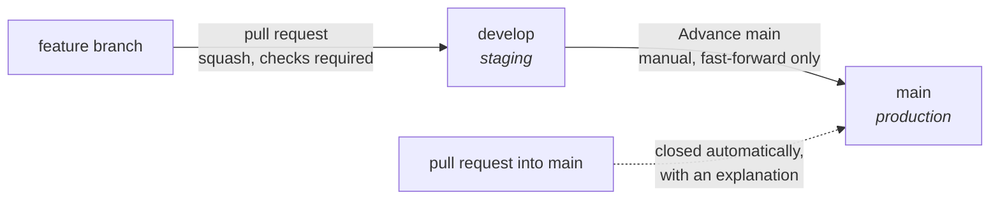

# Deploying a self-hosted Pixel Index

`docker compose up` (see the root `docker-compose.yml` and `.env.example`) gets you a
complete, working index on `localhost` — Postgres, the API, the renderer, and the built
frontend, all talking to each other over the compose network. That's deliberately as far
as this repository's own config goes. Putting a real domain and TLS in front of it is a
separate step, covered here, because there's no one right way to do it — pick the
reverse proxy you already run, or none at all if `localhost`/a private network is enough
for your case. See [`ARCHITECTURE.md`](ARCHITECTURE.md) for *why* there are two origins
to proxy in the first place — this doc only covers the *how*.

Start with **[Environment variables](#environment-variables)** below: it is the
authoritative list of what to set, where each value goes, and what shape it takes —
including the two hosted frontends (GitHub Pages, Vercel), which are configured outside
this repository entirely.

## Environments

Three tiers, each backed by its own API and its own Postgres — see
[#64](https://github.com/pixel-agents-hq/index/issues/64) for the full rationale:

| Tier | Branch | Frontend | API | Data |
|---|---|---|---|---|
| **Production** | `main` | GitHub Pages, *and* a self-hosted deployment (Traefik example below) | The self-hosted deployment's API | Persisted, stable |
| **Staging** | `develop` | Vercel **Production environment** | A second self-hosted deployment, same shape as production, different host/DB | Reset on demand — this is where risk lives before it reaches `main` |
| **PR preview** | any branch | Vercel **Preview environment** | Staging's API (same `VITE_API_BASE_URL` as the Production environment above) | Whatever staging currently holds |

`develop` takes pull requests from anywhere, squash-merged, checks required. **`main`
takes none at all** — not from a feature branch and not from `develop` either. It moves
in exactly one way: a maintainer runs the **Advance main** workflow, and `main`
fast-forwards onto `develop`'s tip.



Three workflows hold that shape, and it is worth knowing which does what when one of
them surprises you:

| Workflow | Trigger | What it does |
|---|---|---|
| `advance-main.yml` | manual dispatch | The promotion. Refuses anything that isn't a fast-forward, and refuses a `develop` whose checks aren't green. |
| `main-pr-guard.yml` | every pull request | Fails on any pull request based on `main`, passes on every other base. This is the *block* — add it as a required status check (see the [setup checklist](#setup-checklist)). |
| `main-pr-reject.yml` | pull request into `main` | Closes it and comments explaining where it belongs. This is the *explanation*, not the block. |

Two of them because they fail in opposite directions: the reject workflow fails open — if
it breaks, the pull request just sits there — while a required status check fails closed,
since a check that never reports keeps the merge button down. Closing rather than only
commenting is deliberate: under this model a pull request into `main` is not "not ready
yet", it is permanently unmergeable, so leaving it open parks something in the list that
nobody can ever clear. Nothing is lost — the branch, the diff and the thread survive a
close, and retargeting at `develop` plus **Reopen** is two clicks.

The promotion being manual is the point. `develop` deploying automatically and `main`
never doing so is what makes staging a staging environment; a `push: develop` trigger on
the promotion would make `main` track `develop` continuously, which is the same as not
having one.

Everything below this section — the three config surfaces, Traefik/Caddy/nginx examples —
applies identically to a production deployment and a staging one; run through it twice,
once per environment, pointing each at its own hostnames and its own `.env`.

## Environment variables

Every deployment-specific string in this project — API hostname, web hostname, Discord
credentials — is configuration, never source. Nothing in this repository contains a real
hostname, and that is a constraint worth keeping: a fork should be deployable without
grepping anyone else's domain out of the code first.

The catch is that "configuration" means **three separate places**, and which one a
variable belongs in is decided entirely by *what reads it*:

| Where | What reads it | What it holds |
|---|---|---|
| **GitHub Actions variables** | `.github/workflows/pages.yml`, at build time | Two public build inputs for the GitHub Pages site. No secrets. |
| **Vercel project env vars** | Vercel's build container, at build time | One public build input, set per-environment. No secrets. |
| **The backend's `.env`** | `services/api` (and `docker-compose.yml`), at run time | Everything. All of the secrets live here and only here. |

### The thing to understand before setting anything

**The two hosted frontends are static files with no backend of their own.** GitHub Pages
and Vercel both build `apps/web` into a folder of HTML/JS and serve it. Neither can hold
a secret: a `VITE_`-prefixed variable is *inlined into the JavaScript bundle a visitor
downloads*, so anything you put there is public by construction. Vite enforces this by
only exposing `VITE_`-prefixed variables to client code in the first place.

So the Discord OAuth credentials do **not** go into GitHub or Vercel. There is no
GitHub-hosted or Vercel-hosted backend to use them. They go in the self-hosted API's
`.env`, next to the API that actually performs the OAuth exchange. The only thing the
hosted frontends need to know is *where that API lives*.

### (a) GitHub Actions — the Pages build

Set both at **Settings → Secrets and variables → Actions → Variables** (the
*Variables* tab, not *Secrets* — neither value is secret, and a secret would be masked
in logs for no benefit).

| Name | Required | Example shape | Notes |
|---|---|---|---|
| `PRODUCTION_API_BASE_URL` | Yes, for a working Pages site | `https://api.example.com` | Origin only, no trailing slash. Baked into the bundle as `VITE_API_BASE_URL`. Also read by `vendor-update.yml` — see below. |
| `PAGES_BASE_PATH` | No | `/` | Only when Pages serves this site from the **root**. Unset for any `/<repo>/` subpath, including under a user-site custom domain — see below. |

**`PRODUCTION_API_BASE_URL` is the shared name for every workflow that builds the SPA**,
not just `pages.yml`. Any workflow that produces a frontend build and needs to render
layouts against a real API, rather than a hardcoded host, should read
`vars.PRODUCTION_API_BASE_URL` and pass it through as `VITE_API_BASE_URL`, exactly as
`pages.yml` does:

```yaml
env:
  VITE_API_BASE_URL: ${{ vars.PRODUCTION_API_BASE_URL }}
```

One variable, one place to change it. Introducing a second name for the same value is how
a repository ends up with one workflow silently building against a stale API.

**Repository-level, not Environment-level.** `pages.yml`'s `build` job declares no
`environment:`, so only repository (or organisation) variables are in scope for it, not
environment-scoped ones. Neither value is secret, so there is nothing an Environment
would protect here. The `github-pages` Environment still exists and is still used — by
the `deploy` job, for the deployment record and its URL.

If `PRODUCTION_API_BASE_URL` is unset, the build still succeeds and the site still
loads; every API call then fails with the client's "Could not reach the API" message
rather than a blank page — intentional, not a bug to work around.

**About `PAGES_BASE_PATH`.** A GitHub Pages *project* site is served from a repo-name
subpath — `https://<user>.github.io/pixel-index/` — and that prefix has to be compiled
into every asset URL at build time, because there is no way to detect it at runtime.
`pages.yml` defaults to `/${{ github.event.repository.name }}/`, which is correct for
`https://<user>.github.io/pixel-index/` today and stays correct through a rename.

**A custom domain does not automatically mean the root.** What decides it is *which*
Pages site the domain belongs to:

- A custom domain on your **user/org site** (`<user>.github.io`) leaves project sites on
  their subpath — `https://example.com/pixel-index/`. `github.io` URLs then 301 to it,
  which also means **the redirect target is the origin your API must allowlist**, not the
  `github.io` one. Keep `PAGES_BASE_PATH` unset here.
- A custom domain on **this repository's own** Pages site serves from the root —
  `https://example.com/`. Set `PAGES_BASE_PATH=/`, or the repo-name prefix 404s every
  asset.

If you are unsure which you have, load the deployed page and look at where the `<script
src>` points: `/pixel-index/assets/…` means keep the subpath, `/assets/…` means root.

**`VENDOR_UPDATE_TOKEN` — a repository *secret*.** Without
it the vendor-update PR opens but arrives with **no checks at all**: GitHub never triggers
`pull_request` workflows for anything `GITHUB_TOKEN` creates, so `ci.yml` simply does not
run on the bot's PR. The gate's own verdict is unaffected — it runs inside the workflow,
not as a check on the PR — but nothing else is verified.

Create it as a **classic** PAT on a machine account that is a collaborator here
(`nntin-bot`), with the **`repo`** scope and nothing else. Not `workflow`: the PR's
`add-paths` never touches `.github/workflows`, and granting it would let the token rewrite
CI. A *fine-grained* token cannot be used for this — they do not work for collaborators on
a repository owned by another account, which is exactly what a machine account is here.

PATs expire. When this one does, the run pushes its branch and renders as usual and then
fails on the last step with a 401 or 403; the workflow prints both that possibility and
the settings one, so the log says which. Mint a replacement on the same account and re-set
the secret — nothing else changes.

**`ADVANCE_MAIN_TOKEN` — the second repository *secret*, and the one `advance-main.yml`
pushes with.** `GITHUB_TOKEN` cannot do this job: `main`'s ruleset requires a pull request
for any change, and `github-actions[bot]` is not on its bypass list — nor can it easily be
put there, which is the practical reason a machine account is the answer here rather than
the ambient Actions identity.

Same account as `VENDOR_UPDATE_TOKEN` (`nntin-bot`), same *classic* PAT reasoning — a
fine-grained token still does not work for a collaborator on a repository owned by
somebody else — but **not the same token**, because the scopes genuinely differ:

| | `VENDOR_UPDATE_TOKEN` | `ADVANCE_MAIN_TOKEN` |
|---|---|---|
| `repo` | yes | yes |
| `workflow` | **no**, deliberately — its PR's `add-paths` never touches `.github/`, and granting it would let the token rewrite CI | **yes**, unavoidably — a promotion carries whatever `develop` holds, including workflow changes, and git refuses a PAT without `workflow` scope any push that modifies `.github/workflows` |

That refusal is worth recognising when you hit it: the push fails with
`refusing to allow a Personal Access Token to create or update workflow`, on a run where
everything else passed, and only for promotions that happen to contain a CI change. Mint
the token with both scopes and it never comes up.

The scope is only half of it — see the [setup checklist](#setup-checklist) for the ruleset
bypass entry, without which a correctly-scoped token is still refused.

**One repository setting `vendor-update.yml` cannot work without.** Settings → Actions →
General → Workflow permissions → **"Allow GitHub Actions to create and approve pull
requests"**. It is off by default, and without it the job pushes its branch and its
renders successfully and is then refused at the last step, with
`GitHub Actions is not permitted to create or approve pull requests`. The workflow
detects that specific failure and prints both the setting and a link to open the PR by
hand, so nothing is lost either way — but until it is enabled, every scheduled run ends red
and needs a click. Nothing else in this repository needs the setting.

**`PRODUCTION_API_BASE_URL` has a second reader: `vendor-update.yml`.** The daily job
that bumps the pinned Pixel Agents uses it to fetch every public layout from your
running index — `GET /api/v1/export/layouts.ndjson` — and render them against the
candidate pin, so the PR can say exactly which of *your* layouts a bump would break.
Leave it unset and the job still runs, but only over the committed `seed/` layouts: it
reports that it did so rather than passing silently on a corpus of four.

**A third reader: `backup.yml` (#63).** The daily backup job downloads
`GET /api/v1/admin/backup` — every public and hidden layout, zipped, mirroring `seed/`'s
own `<slug>/{layout.json,meta.json}` shape — and uploads it as a 90-day workflow artifact.
Unlike `vendor-update.yml` there is no `seed/`-only fallback: a backup of four demo
layouts is not a backup of production, so the job refuses outright with no
`PRODUCTION_API_BASE_URL` set rather than quietly running against nothing.

**`BACKUP_API_KEY` — a repository *secret*, and a different kind of secret than
`VENDOR_UPDATE_TOKEN`/`ADVANCE_MAIN_TOKEN` below.** Those two are GitHub PATs — credentials
for pushing *git*. This is a Pixel Index *API* credential, but not a Discord session either:
it is a **static, non-rotating shared secret**, checked by `GET /api/v1/admin/backup`
(`backup/export.ts`) against the API's own `BACKUP_API_KEY` environment variable
(`config.ts`'s `backupApiKey`) before, and independently of, the ordinary admin-session
check every other `/admin/*` route uses. Same pattern as `SESSION_SECRET` or
`DISCORD_CLIENT_SECRET` just above — a value you generate once and set on both sides — not
a credential minted by logging into the app.

An earlier version of this mechanism reused a real admin's Discord session refresh token
instead. That token rotates on every use (`auth/sessions.ts`'s reuse detection), which meant
the workflow had to write the newly-rotated value back into this same secret after every
run using a second PAT, and had no fast way to revoke a leaked copy short of kicking the
underlying Discord account. A static shared secret has neither problem — nothing rotates,
so there is nothing to persist back to GitHub, and revocation is just "generate a new value
and redeploy both sides" (below) — at the cost of a real tradeoff of its own: rotating it is
a deploy, not a click, and it is only ever as secret as the two places that hold it.

Mint one and set it on both sides:

```bash
openssl rand -base64 32
```

Set the result as this API's own `BACKUP_API_KEY` environment variable (`.env` for a
self-hosted deployment — see "The self-hosted backend" below) and redeploy/restart the API
so it picks the value up, then:

```bash
gh secret set BACKUP_API_KEY   # paste the same value
```

Leave it unset on the API and the header check is simply never available — `backup.yml`
then fails loudly with a clear message (it has no session to fall back to; it is not a
human), rather than the route silently becoming unreachable by automation.

**Scoped to read-only backup export, on purpose.** This key only ever works on
`GET /api/v1/admin/backup` — `POST /api/v1/admin/backup/import` never reads it, staying
admin-session-only exactly as it always has. A leaked key can read every hidden layout; it
can never moderate, delete, or overwrite a single one. Standing access sitting in a
repository secret is still worth the same caution the deployment docs already give
`VENDOR_UPDATE_TOKEN`/`ADVANCE_MAIN_TOKEN` — **rotate it like production access** — but
rotation here is deterministic and immediate: generate a new value with the command above,
set it on both sides, redeploy. The old value stops working the instant the API restarts
with the new one.

The static renderer gate is not the only candidate-pin check. The workflow also builds
the web SPA at its real Pages subpath and drives the layout detail page in Chromium with
the candidate's bundled default layout. It requires a painted canvas, upstream activity
panels, working agent controls, and persisted live/thumbnail mode. A failure is included
in the update PR, uploaded with browser diagnostics, and fails the workflow at the final
gate even when every static PNG still renders.

**Candidate previews need no configuration at all.** That same job publishes the renders
it already produced to an orphan branch, `vendor-previews`, force-pushed as a single
commit so old sets become unreachable and the repository does not grow a PNG set a day
forever. A Vercel **preview** build then pulls them into its own `dist/`, keyed on the
pinned commit, and serves them from its own origin — see
[`preview-deployments.md`](preview-deployments.md).

Nothing to set. The mechanism is gated on `VERCEL_ENV === 'preview'`, a Vercel system
variable, so a production build and a GitHub Pages build cannot show candidate renders
whatever else is true. It also means visitors never fetch from
`raw.githubusercontent.com`: the build downloads once, and the site serves the copies.

**The swap needs the API to report its pin.** It only engages when the site can prove the
API is on a *different* Pixel Agents than the renders were made with — otherwise it fails
safe and leaves previews on the API's own images, because a live image that might be
slightly stale beats a static one that is certainly stale. A current build reports its
commit with no configuration at all (see *The pinned commit ships as a file* below), so
this works out of the box; an API reporting `commit: null` is one that predates that and
needs redeploying. `vendor-update.yml` checks for exactly this and says so in the PR.

### (b) Vercel — Production and Preview

The Vercel project's **Root Directory must be `apps/web`** (that is where `vercel.json`
lives, and its `installCommand`/`buildCommand` reach back up to the monorepo root).

| Name | Required | Example shape | Set for |
|---|---|---|---|
| `VITE_API_BASE_URL` | Yes | `https://api.example.com` | Production, Preview (and Development if you use `vercel dev`) |

Do **not** set `VITE_BASE_PATH` on Vercel — it serves from the root, and `vercel.json`'s
rewrite already handles deep links.

**This cannot live in `vercel.json`.** Two reasons, either one sufficient: `vercel.json`
has no supported way to vary a value between the Production and Preview environments,
and it is a committed file, so putting a real API hostname in it would drop the exact
domain reference this project keeps out of its source. Set it in the dashboard
(**Project → Settings → Environment Variables**), or with the CLI:

```bash
vercel env add VITE_API_BASE_URL production   # then paste the value when prompted
vercel env add VITE_API_BASE_URL preview
```

Vercel bakes env vars in at build time, so changing one requires a **redeploy** —
existing deployments keep the old value. Use "Redeploy" without the build cache.

**Deployment Protection decides whether a preview is readable at all.** Under
**Project → Settings → Deployment Protection → Vercel Authentication**, Vercel's default
("Standard Protection") puts every preview deployment behind a Vercel login. The symptom
is unmistakable once you know it: the preview URL answers `302` with
`location: https://vercel.com/sso-api?url=…` instead of serving the app, so a logged-out
visitor — a PR reviewer, a contributor, anything automated — cannot open it and `curl`
cannot check it either. Nothing about your environment variables is wrong when this
happens.

Leave it on if previews should stay team-only; set it to **Disabled** if PR previews are
meant to be shareable. Note that turning it off makes any preview URL public, and Vercel
posts those URLs into PR comments — on a public repository, treat "anyone with the URL"
as "anyone". Keep **Git Fork Protection** on regardless: it is a separate setting, and it
is what stops a fork's PR from building with your project's environment variables.

Worth deciding alongside it: a Preview `VITE_API_BASE_URL` pointing at production makes
every preview a fully functional client against live data — login and submission
included — before any review. Point Preview at a staging API if that is more exposure
than you want.

**Preview deploys need one thing from the backend.** Every Vercel PR preview gets a
fresh hostname (`https://<project>-<build-hash>-<team>.vercel.app`), so there is no
exact origin to put in the API's `PUBLIC_WEB_ORIGIN` and credentialed calls from a
preview fail CORS. That is what `PUBLIC_WEB_ORIGIN_PATTERNS` in the backend `.env`
is for — see below.

### (c) The self-hosted backend — `.env`

Copy `.env.example` to `.env` (gitignored) and fill it in. `docker-compose.yml` reads
it, and fails the container start with a named message for anything required that is
missing. `services/api` re-validates at boot and reports *every* problem at once rather
than one restart per missing value.

| Name | Required | Example shape | Notes |
|---|---|---|---|
| `POSTGRES_USER` / `POSTGRES_DB` | No | `pixel_index` | Defaults are fine. |
| `POSTGRES_PASSWORD` | **Yes** | *(random string)* | Compose refuses to start without it. |
| `RENDERER_URL` | No | `http://renderer:3000` | The compose-network default. |
| `PUBLIC_WEB_ORIGIN` | **Yes** | `https://gallery.example.com` | Comma-separated for several. Origin only — scheme + host + optional port, **no path, no trailing slash**. This is the CORS allowlist *and* the OAuth `returnTo` allowlist. |
| `PUBLIC_WEB_ORIGIN_PATTERNS` | No | `https://my-project-*-my-team.vercel.app` | Opt-in wildcard for per-deploy preview hostnames. See below. |
| `PUBLIC_API_ORIGIN` | **Yes** | `https://api.example.com` | This API's own public origin. Origin only. Must match the Discord Developer Portal exactly — see the Discord section. |
| `DISCORD_CLIENT_ID` | **Yes** | `1234567890123456789` | Public, but it lives here because the API is what uses it. |
| `DISCORD_CLIENT_SECRET` | **Yes** | *(from the Developer Portal)* | **Secret.** Never in GitHub, never in Vercel, never in a `VITE_` variable. |
| `SESSION_SECRET` | **Yes** | 32+ chars, `openssl rand -base64 48` | **Secret.** Signs access tokens and the OAuth state cookie. Rejected below 32 characters. |
| `WEBHOOK_SECRET_ENCRYPTION_KEY` | **Yes** | `openssl rand -base64 32` | **API-only secret.** Encrypts moderator-issued webhook signing secrets in Postgres. Keep it stable and backed up; changing it makes existing subscriptions require rotation. |
| `DISCORD_ADMIN_IDS` | No | `999888777666555444` | Comma-separated Discord user IDs that receive Admin. Works with or without guild gating. |
| `DISCORD_GUILD_ID` | No | `1478428628709802166` | Enables membership gating and direct Discord role checks. Leave blank for a fully functional unguilded self-hosted index. |
| `DISCORD_MODERATOR_ROLE_IDS` | With a guild | `1528065925264445622` | Comma-separated Discord role IDs that receive Moderator. |
| `DISCORD_INVITE_URL` | With a guild | `https://discord.gg/...` | HTTPS invite shown to authenticated outsiders. |
| `DISCORD_OAUTH_TOKEN_ENCRYPTION_KEY` | With a guild | `openssl rand -base64 32` | **API-only secret.** Encrypts retained Discord OAuth grants in Postgres. |
| `DISCORD_MEMBERSHIP_CACHE_TTL_MS` | No | `60000` | Recommended one-minute role/membership cache. |
| `BACKUP_API_KEY` | No | `openssl rand -base64 32` | **API-only secret** (#63). Static shared secret `backup.yml` sends as `X-Backup-Api-Key` on `GET /api/v1/admin/backup`. Rejected below 32 characters. Unset means that route is admin-session-only — see "`BACKUP_API_KEY`" above. |
| `VITE_API_BASE_URL` | Only if you build the `web` image | `https://api.example.com` | **Build-time**, baked into the bundle by `apps/web/Dockerfile`. `docker compose build web` after a change — restarting is not enough. |
| `API_COMMIT` | No | `$(git rev-parse HEAD)` | **Build-time**, baked into the `api` image by `services/api/Dockerfile`. Unset means `GET /` and `GET /api/v1/meta` report `commit: null` — see below. |
| `API_TRUST_PROXY` | No (`true` by default in the app) | `true` | Compose ships `false`. Flip it to `true` the moment a reverse proxy is in front — see above. |
| `WEB_PORT` / `API_PORT_HOST` | No | `8080` / `3000` | Host ports. |

Tuning knobs with working defaults you can usually ignore: `API_HOST`, `API_PORT`,
`LOG_LEVEL`, `API_BODY_LIMIT_BYTES`, `MAX_LAYOUT_BYTES`, `MAX_IMPORT_BYTES`,
`MAX_SUBMISSIONS_PER_USER_PER_DAY`, `MAX_SHARES_PER_USER_PER_DAY`, `RATE_LIMIT_*`, `ACCESS_TOKEN_TTL_MS`,
`REFRESH_TOKEN_TTL_MS`, `LOGIN_CODE_TTL_MS`, `PIXEL_AGENTS_DIR`.
`services/api/src/config.ts` is the authoritative list. `MAX_IMPORT_BYTES` (default 50MB)
is the one exception to `API_BODY_LIMIT_BYTES` above (#63) — `POST
/api/v1/admin/backup/import`'s own, larger body-size cap, since it accepts a zip of
potentially hundreds of layouts rather than one.

### The pinned commit ships as a file

Nothing to configure — the failure this avoids is quiet.

A container cannot work out which Pixel Agents it holds. `vendor/pixel-agents/.git` is a
*pointer* to a gitdir outside the Docker build context (under a git worktree, an absolute
path on the build machine), so a copied vendor tree can never resolve its own commit
however much of it you copy. Without that commit the renderer's preview cache key falls
back to the upstream *version*, which the pin routinely outruns by several commits — two
different builds then serve each other's cached previews — and `/api/v1/meta` cannot say
which upstream the index is actually serving.

The pin travels as `vendor/pixel-agents.commit`, copied into both images, kept equal to
the gitlink by `npm run vendor:commit`, updated by the vendor-update workflow in the same
commit as the bump, and verified on every CI run by `npm run vendor:commit:check` so it
cannot drift from the pin it claims to describe.

### `API_COMMIT` — pixel-index's own commit, a build argument instead

A different, easier problem from the one above. `vendor/pixel-agents.commit` exists
because the *submodule's* `.git` is unreachable from inside the build context. This
repository's own `.git` has no such issue — whoever runs `docker build` or `docker
compose build` on a checkout of this repo has that checkout's own `.git` sitting right
there, the same as any ordinary image build. So `API_COMMIT` stays a plain build
argument rather than a committed stamp file: pass this repo's own `git rev-parse HEAD`
at build time and `services/api/Dockerfile` bakes it in as an `ENV`, read at runtime by
`GET /` and `GET /api/v1/meta`.

```sh
API_COMMIT=$(git rev-parse HEAD) docker compose build api
```

Leaving it unset does not fail the build — this is informational (which commit a third
party is actually talking to), not load-bearing the way the vendor pin is — it just
means both endpoints report `commit: null` until you rebuild with it set.

#### `PUBLIC_WEB_ORIGIN_PATTERNS`, and its trade-off

`PUBLIC_WEB_ORIGIN` takes exact origins only, on purpose. But a Vercel PR preview's
hostname is minted per deploy and cannot be enumerated in advance, so previews of this
repo's frontend get no CORS access and no working login. This variable is the opt-in
escape hatch:

```text
PUBLIC_WEB_ORIGIN_PATTERNS=https://my-project-*-my-team.vercel.app
```

Validated at boot, and deliberately narrow:

- **https only.** A credentialed wildcard over cleartext is not defensible.
- **Exactly one `*` per pattern**, and it never crosses a dot — it stands in for part of
  a single hostname label. `https://app-*.example.com` can therefore never match
  `https://app-x.evil.example.com`.
- **Whole-label wildcards are rejected.** `https://*.vercel.app` fails at boot, because
  it would grant credentialed access to every project on a shared platform domain.

The residual risk, stated plainly: **anyone who can deploy a hostname matching your
pattern gets the same credentialed access your own previews do.** On a shared platform
domain like `vercel.app`, pin as much literal text as you can — critically your *team
slug*, which a stranger cannot mint under your project's name. If you would rather not
take the trade-off at all, leave it unset: previews then work read-only against a public
API, or you point previews at a separate staging API whose exact origin you *can* list.

Comma-separate for more than one. Both the CORS check and the OAuth redirect allowlist
consult it, so login from a preview works end to end rather than redirecting
successfully and then failing on the first API call.

#### Discord OAuth, membership, and roles

The API performs Discord OAuth2 authorization-code flow with PKCE. Without a configured
guild it requests `identify`; with `DISCORD_GUILD_ID` it requests `identify
guilds.members.read`, retains the encrypted user grant, and directly calls Discord's
current-user guild-member endpoint. Pico and a bot token are not involved.

The one that bites people: **the redirect URI is always `${PUBLIC_API_ORIGIN}/callback`**
— derived from config, never from request input — and Discord matches it byte-for-byte
against what you registered. If `PUBLIC_API_ORIGIN` is `https://api.example.com`, then
`https://api.example.com/callback` must be listed under **Redirects** in the Discord
Developer Portal, with no trailing slash and the same scheme. A mismatch surfaces as
Discord's own `invalid_request` error page before your API is ever reached. Registering
several redirect URIs is fine, so a staging API can coexist with production.

The API alone receives `DISCORD_OAUTH_TOKEN_ENCRYPTION_KEY`; do not add it to Vercel,
the web image, renderer, Postgres, Pico, or Discord. The deployment operator/secret
manager and API process are the only parties that know it. Keep it stable and backed up
or users must reconnect Discord. Full capability and privacy behavior is documented in
[`docs/discord-integration.md`](discord-integration.md).

## Setup checklist

Everything below has to be done by the repository owner in a web UI or with an
authenticated CLI — none of it can be committed.

**1. GitHub — Actions variables** (Settings → Secrets and variables → Actions → Variables)

```bash
gh variable set PRODUCTION_API_BASE_URL --body "https://api.example.com"
# Only if Pages serves this site from the ROOT (skip for any /<repo>/ subpath —
# including under a custom domain on your user site, which keeps the subpath):
gh variable set PAGES_BASE_PATH --body "/"
gh variable list   # verify
```

No new Environment is needed: `github-pages` already exists and is used by the `deploy`
job; `Preview` and `Production` are Vercel's own and hold nothing this build reads.

**2. GitHub — secrets** (Settings → Secrets and variables → Actions → Secrets)

```bash
# Both are classic PATs on the nntin-bot machine account. Scopes differ — see
# "VENDOR_UPDATE_TOKEN" and "ADVANCE_MAIN_TOKEN" above for why.
gh secret set VENDOR_UPDATE_TOKEN   # scopes: repo
gh secret set ADVANCE_MAIN_TOKEN    # scopes: repo, workflow

# Not a GitHub PAT — see "BACKUP_API_KEY" above for what this actually is (a
# static shared secret, not a Discord session) and how to mint/set it.
gh secret set BACKUP_API_KEY   # same value as the API's own BACKUP_API_KEY env var
```

**3. GitHub — the branch ruleset** (Settings → Rules → Rulesets). This is what makes the
[Environments](#environments) model real rather than a convention, and it is the one step
that needs *admin*, not maintain.

Today a single ruleset — `PR protection` — covers `main` and `develop` with identical
rules. Three changes:

- **Add `main does not take pull requests` as a required status check.** That is
  `main-pr-guard.yml`'s job name, and it is what actually stops a pull request into `main`
  from being mergeable. Safe to add to the *combined* ruleset without splitting it first:
  the workflow runs on every pull request and passes for every base except `main`,
  precisely so that adding it here cannot leave `develop`'s pull requests waiting on a
  check that never reports.
- **Split `main` out, or add a `main`-only ruleset, to fix the merge methods.** `develop`
  should allow squash only (the issue's rule, and what keeps its history one commit per
  pull request); `main`'s merge methods stop mattering once nothing merges into it, but
  leaving all three enabled reads as though something might.
- **Add `nntin-bot` to `main`'s bypass list** — this is what `advance-main.yml` needs, and
  it is the answer to "is there such a thing as a workflow bypass": there is, it is the
  ruleset's Bypass list, and it takes actors rather than tokens. In the REST API that is
  `{"actor_type": "User", "actor_id": <nntin-bot's id>, "bypass_mode": "always"}`;
  `Integration` (a GitHub App), `Team`, `RepositoryRole` and `OrganizationAdmin` are the
  other actor types, and a role or team entry would be the way to do this without naming
  an individual account. A PAT inherits the bypass of the account it authenticates as,
  which is what makes the machine-account approach work at all.

  Two things to know about that entry. It is **whole-ruleset, not per-rule** — `nntin-bot`
  ends up exempt from `non_fast_forward` and the required checks too, not just from the
  pull-request requirement. So the fast-forward guarantee comes from `advance-main.yml`
  refusing to push anything that isn't one (`git merge-base --is-ancestor`, and a bare
  `git push` with no `--force`), not from the ruleset; the ruleset is the backstop for
  everyone *else*. And it is a standing grant on a token that lives in CI, so `repo` scope
  on that PAT is worth treating as production access — rotate it like one.

```bash
# What is there now, before changing anything:
gh api repos/pixel-agents-hq/index/rulesets --jq '.[] | "\(.id)\t\(.name)"'
gh api repos/pixel-agents-hq/index/rulesets/<id>
gh api users/nntin-bot --jq .id   # the actor_id for the bypass entry
```

**The first promotion has to be done by hand.** These workflows arrive on `develop`
first, and `main` only gets them by being promoted — but a `workflow_dispatch` workflow
is only listed in the Actions tab, and only resolvable by filename through the API, once
it exists on the *default* branch. So **Advance main** cannot perform the promotion that
would give `main` **Advance main**. Break the loop once, as an admin:

```bash
git fetch origin main develop
git merge-base --is-ancestor origin/main origin/develop && \
  git push origin origin/develop:refs/heads/main
```

Every promotion after that is the workflow.

**4. Vercel** (Project → Settings; Root Directory must be `apps/web`)

Set the **Production Branch** (Settings → Git) to `develop`. Vercel hosts staging, not
production — `main` is GitHub Pages plus the self-hosted stack, and should not be a Vercel
deployment at all. Then both environments get staging's API, because a PR preview is meant
to reuse it:

```bash
# --no-sensitive matters: the CLI defaults to Sensitive non-interactively, and a
# Sensitive value cannot be read back to verify. Neither value is a secret.
vercel env add VITE_API_BASE_URL production --no-sensitive
vercel env add VITE_API_BASE_URL preview --no-sensitive
# Then redeploy — env vars are baked in at build time.
```

Then decide **Deployment Protection** (Settings → Deployment Protection → Vercel
Authentication), which is a dashboard setting only the project owner can change. While it
is on, previews require a Vercel login, so they cannot be opened by a logged-out reviewer
or checked anonymously — a preview URL returns `302` to `vercel.com/sso-api` rather than
the app. Set it to **Disabled** if PR previews should be publicly shareable; leave it on
if they should stay team-only. Either way, verify with:

```bash
curl -s -o /dev/null -w '%{http_code}\n' https://<preview-url>/   # 200 public, 302 protected
```

**5. The backend host** — `cp .env.example .env`, then fill in. Twice, once per
environment: production and staging are two deployments of this same stack, each with its
own hostnames, its own database and its own `.env`.

```bash
POSTGRES_PASSWORD=...                 # any strong random string
PUBLIC_WEB_ORIGIN=https://gallery.example.com,https://<user>.github.io
PUBLIC_API_ORIGIN=https://api.example.com
DISCORD_CLIENT_ID=...                 # Discord Developer Portal → OAuth2
DISCORD_CLIENT_SECRET=...
SESSION_SECRET=$(openssl rand -base64 48)
WEBHOOK_SECRET_ENCRYPTION_KEY=$(openssl rand -base64 32)
DISCORD_ADMIN_IDS=...                 # comma-separated Discord user IDs
# Optional official-community integration (omit all for unguilded self-hosting):
DISCORD_GUILD_ID=...
DISCORD_MODERATOR_ROLE_IDS=...
DISCORD_INVITE_URL=https://discord.gg/...
DISCORD_OAUTH_TOKEN_ENCRYPTION_KEY=$(openssl rand -base64 32)
DISCORD_MEMBERSHIP_CACHE_TTL_MS=60000
VITE_API_BASE_URL=https://api.example.com
API_TRUST_PROXY=true                  # once a reverse proxy is in front
# Only if you want Vercel PR previews to work with credentials:
PUBLIC_WEB_ORIGIN_PATTERNS=https://my-project-*-my-team.vercel.app
```

then `docker compose up --build -d`.

**6. Discord Developer Portal** — under OAuth2 → Redirects, add
`${PUBLIC_API_ORIGIN}/callback` exactly (e.g. `https://api.example.com/callback`). One
entry per environment: a single app takes several redirect URIs, so staging needs its own
line there rather than its own application, unless you would rather keep the two entirely
separate.

**7. Verify.** `curl https://api.example.com/health`; open the Pages and Vercel sites and
confirm layouts load; click through a Discord login.

The single most useful check, because it distinguishes "misconfigured" from "built before
you configured it" — grep the *deployed* bundle for your API host:

```bash
SITE=https://example.com/pixel-index      # or your Vercel URL
JS=$(curl -s "$SITE/" | grep -oE '/[a-z-]*/?assets/[^"]*\.js' | head -1)
curl -s "$SITE$JS" | grep -c 'api\.example\.com'   # 0 means the build never saw the variable
```

`VITE_API_BASE_URL` is baked in at build time, so a correct variable set *after* the last
build changes nothing until you rebuild. If the count is 0 and `localhost:3000` is present
instead, that is exactly what happened: rebuild rather than hunting for a config error.

A CORS failure in the browser
console means the origin you are *browsing from* is missing from `PUBLIC_WEB_ORIGIN` (or
from `PUBLIC_WEB_ORIGIN_PATTERNS`, for a preview) — the API must be restarted after
changing either.

Note that a GitHub Pages site (`https://<user>.github.io`) and a custom-domain site are
**different origins**, and both must be listed in `PUBLIC_WEB_ORIGIN` if you want both to
work. The origin is the host only — `https://<user>.github.io`, never
`https://<user>.github.io/pixel-index`.

**Allowlist the origin the browser actually ends up on.** If a custom domain is
configured, GitHub 301-redirects `github.io` URLs to it, so the page runs — and sends its
`Origin` header — under the custom domain. Allowlisting only the `github.io` host in that
setup looks correct and never matches anything, because that host only ever redirects. A
one-liner that tells you exactly which host to list:

```bash
curl -sL -o /dev/null -w '%{url_effective}\n' https://<user>.github.io/pixel-index/
```

The same applies to any other redirect in front of the site.

## What you're actually proxying

Two origins, both plain HTTP inside the compose network:

| Service | Compose port | What it needs from a proxy |
|---|---|---|
| `web` | `${WEB_PORT:-8080}` | TLS termination. Nothing else — it's static files. |
| `api` | `${API_PORT_HOST:-3000}` | TLS termination, and **`X-Forwarded-For`** set correctly (see below). |

`renderer` has no exposed port and needs no proxy entry — it isn't reachable from
outside the compose network at all (see `services/api/README.md`'s note on
`preview-check` for why).

Whatever domains you put in front of `web` and `api`, update `.env`'s
`PUBLIC_WEB_ORIGIN` and `PUBLIC_API_ORIGIN` to match exactly (scheme + host, no path, no
trailing slash) and rebuild (`docker compose up --build`) — these are baked into CORS's
allowlist and the frontend's build-time API base URL, not read at request time.

### Set `API_TRUST_PROXY=true` once you add one

`docker-compose.yml` ships `API_TRUST_PROXY=false` because, with no proxy in front, the
API only ever sees the real client IP directly. The moment you put a reverse proxy in
front of it, flip this to `true` in `.env` — otherwise rate limiting keys on the proxy's
IP, and every client behind it shares one bucket.

### `localhost` inside a container resolves to IPv6 first

Every health check in this repo's images probes `127.0.0.1`, never `localhost`. A
listener bound to IPv4 only fails a check against `localhost` inside a container, gets
marked unhealthy, and a reverse proxy then quietly drops it from rotation with nothing
more informative than a bare 404 — the request never reached the app. Bind your own
health checks and proxy upstreams by explicit address, not by hostname.

## Traefik

```yaml
services:
  web:
    labels:
      - "traefik.enable=true"
      - "traefik.http.routers.pixel-index-web.rule=Host(`gallery.example.com`)"
      - "traefik.http.routers.pixel-index-web.entrypoints=websecure"
      - "traefik.http.routers.pixel-index-web.tls.certresolver=letsencrypt"
      - "traefik.http.services.pixel-index-web.loadbalancer.server.port=80"

  api:
    labels:
      - "traefik.enable=true"
      - "traefik.http.routers.pixel-index-api.rule=Host(`api.example.com`)"
      - "traefik.http.routers.pixel-index-api.entrypoints=websecure"
      - "traefik.http.routers.pixel-index-api.tls.certresolver=letsencrypt"
      - "traefik.http.services.pixel-index-api.loadbalancer.server.port=3000"
```

Add these under the matching service in your own compose override (or merge into
`docker-compose.yml` directly) — they're deliberately not in the shipped file, so
running Caddy or nginx instead doesn't mean deleting Traefik config first. Both services
need to be on whatever network your Traefik instance watches; add it under each
service's `networks:` and to the top-level `networks:` block as `external: true`.

## Caddy

A `Caddyfile` alongside (not replacing) this repo's compose file:

```text
gallery.example.com {
    reverse_proxy web:80
}

api.example.com {
    reverse_proxy api:3000
}
```

Caddy handles TLS (via Let's Encrypt) with no further config. Run it as its own compose
service on the same network as `web`/`api`, or as a separate process on the host if
you've exposed `WEB_PORT`/`API_PORT_HOST` there.

## nginx

```nginx
server {
    listen 443 ssl;
    server_name gallery.example.com;
    # ssl_certificate / ssl_certificate_key — your own TLS setup.

    location / {
        proxy_pass http://127.0.0.1:8080;
        proxy_set_header Host $host;
    }
}

server {
    listen 443 ssl;
    server_name api.example.com;
    # ssl_certificate / ssl_certificate_key — your own TLS setup.

    location / {
        proxy_pass http://127.0.0.1:3000;
        proxy_set_header Host $host;
        # Required once API_TRUST_PROXY=true (see above) — without this the
        # API's rate limiter keys on nginx's own IP for every client.
        proxy_set_header X-Forwarded-For $proxy_add_x_forwarded_for;
        proxy_set_header X-Forwarded-Proto $scheme;
    }
}
```

Assumes nginx runs on the host (not in the compose network) talking to the ports
`WEB_PORT`/`API_PORT_HOST` expose — adjust `proxy_pass` to the container's compose
network address if you run nginx as its own service instead.

## No reverse proxy at all

Perfectly reasonable for a private network or `localhost`-only use: just leave
`PUBLIC_WEB_ORIGIN`/`PUBLIC_API_ORIGIN` as `http://` origins pointing at wherever you've
exposed the ports, skip Discord login entirely (it needs a real, stable origin
Discord's OAuth redirect can reach), and browse read-only.

## Where the official index runs

That's a deployment decision outside this repository, not a default this config
encodes — this document (and `docker-compose.yml`) is written so any of the above (or
none of them) works equally well, with no homelab-specific assumption baked in.
