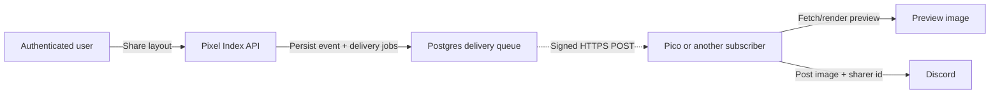

# Webhook events

Pixel Index can notify an external service when an authenticated user chooses to share
a layout. The first consumer is expected to be Pico, the Discord bot: Pixel Index sends
the event, Pico obtains a preview image, and Pico posts the image to Discord together
with the Discord user id of the person who shared it.

The share endpoint, subscription management and outbound delivery are implemented by
[issue #91](https://github.com/pixel-agents-hq/index/issues/91). This document is the
integrator contract for those running pieces, not a proposed future interface.

## From Share to a subscriber



Share and Publish are separate actions. A user can share a layout that has never been
submitted to the index. Consequently, every event includes the complete `layout.json`;
a slug or fetch URL could not represent the unpublished case. Inlining can make a
delivery as large as the configured layout-size limit—2 MB by default—and repeats those
bytes for every subscription, but it gives each receiver an immutable snapshot that
does not disappear if a slug is renamed or a published layout is later hidden.

The API resolves identities and publication information itself. A subscriber must not
interpret these fields as assertions supplied by an untrusted browser:

- `sharerDiscordId` identifies the authenticated actor who selected Share.
- `owner` is the layout owner's display snapshot and can describe someone other than
  the sharer. Its `discordId` is absent only for a legacy credit with no linked Discord
  account.
- `publication.published` is true only when the layout has a publicly retrievable API
  resource at the time of the event. Its absolute `url` is present exactly in that
  case. A later moderation or owner action may make that historical URL return 404.

For a layout that has no public resource, publication is represented as:

```json
{
  "published": false
}
```

There is no `url: null` or empty-string placeholder.

## Trigger endpoint and limits

An authenticated browser or API client calls `POST /api/v1/layouts/share` with exactly
one of these bodies:

```json
{ "slug": "four-rooms" }
```

This form shares the server's snapshot of a currently public layout and records its
public API URL. To share work that has not been published, send the complete layout:

```json
{
  "layout": {
    "version": 1,
    "layoutRevision": 1,
    "cols": 1,
    "rows": 1,
    "tiles": [0],
    "furniture": []
  }
}
```

The API validates an inline layout with the same pinned Pixel Agents validator used for
publishing. Its owner is the authenticated sharer. A successful request returns `202`
with `{ eventId, occurredAt, deliveriesQueued }`; acceptance means the event and one job
per active subscription are durable in Postgres, not that every receiver has already
acknowledged it.

Share is an authenticated, per-user action. The endpoint enforces both limits from the
parent design:

- At most one accepted share in a rolling five-minute window.
- At most five accepted shares in a rolling 24-hour window, persisted with the events.

An attempt over either limit is rejected with the API's normal `429` error response and
does not create an event to deliver later. These limits bound outbound fan-out and
preview work, protect subscribers from spam, and make a leaked user session less useful
for amplification. They limit event creation; they do not promise when an accepted
event reaches a subscriber.

## Subscriptions and secrets

A moderator or admin creates a subscription at `/moderation/webhooks`, giving the
service a unique name and its HTTPS receiver URL. Pixel Index records the creating
moderator's Discord-backed identity. The Admin view lists the subscriptions and who
created each one, without revealing their secrets. The underlying authenticated API is
`POST /api/v1/moderation/webhook-subscriptions` with
`{ "name": "Pico", "endpointUrl": "https://…" }`.

Each subscription receives an independent, cryptographically random `whsec_…` secret.
The create response and page show it **once**; it must then be stored in the receiving
service's secret manager. Later responses show only its final four characters. Pixel
Index stores the usable secret encrypted with AES-256-GCM under the API-only
`WEBHOOK_SECRET_ENCRYPTION_KEY`. A secret is associated with the creator's Discord user
id, but is never derived from that public id. The payload contains the non-secret
`subscriptionId`, not the secret or a secret prefix.

The creator or an admin can rotate a secret; rotation also shows the replacement exactly
once and invalidates the old secret immediately. An admin can deactivate/reactivate a
subscription. Deactivation cancels queued retries and prevents new delivery jobs; it
does not delete history. The Admin view also shows the last attempt/success/failure and
the number of events whose retries were exhausted consecutively.

## Payload contract

The source of truth is the
[version 1 share-event JSON Schema](../services/api/schema/share-event-v1.schema.json).
Its inline `layout` field references the existing
[layout JSON Schema](../packages/layout-core/schema/layout.schema.json) rather than
copying that definition. Both schemas use JSON Schema draft 2020-12.

Every event has a reusable envelope:

- `eventId` identifies one logical share and remains stable on every retry and for
  every subscription.
- `eventType` is `layout.shared`.
- `schemaVersion` is `1`.
- `occurredAt` records when the share was accepted, not when a retry was attempted.
- `subscriptionId` identifies the destination without disclosing its secret.
- `data` contains the sharer, owner, inline layout and publication snapshot.

A receiver with more than one subscription uses `(subscriptionId, eventId)` as its
deduplication key. It must reject or safely ignore event types and schema versions it
does not implement. A breaking payload change creates a new schema version; version 1
will not be silently redefined underneath existing subscribers.

### Complete published example

The example is illustrative, while the linked schema remains authoritative. A contract
test extracts this marked block and validates it against the schema so its field names
and required values cannot drift unnoticed.

<!-- share-event-example:start -->
```json
{
  "eventId": "a75fc4d8-d0f7-4b26-9c6d-3329f9fc2834",
  "eventType": "layout.shared",
  "schemaVersion": 1,
  "occurredAt": "2026-08-15T12:34:56.000Z",
  "subscriptionId": "46fe73a0-8c49-438f-a6df-bb5d3290551a",
  "data": {
    "sharerDiscordId": "1528094749993599038",
    "owner": {
      "discordId": "77488778255540224",
      "username": "layout-owner",
      "displayName": "Layout Owner"
    },
    "layout": {
      "version": 1,
      "layoutRevision": 1,
      "cols": 2,
      "rows": 2,
      "tiles": [0, 0, 0, 0],
      "furniture": []
    },
    "publication": {
      "published": true,
      "url": "https://api.example.com/api/v1/layouts/four-rooms"
    }
  }
}
```
<!-- share-event-example:end -->

## Authenticating a delivery

The event body identifies a subscription but does not prove who sent it. Every delivery
uses a versioned HMAC-SHA256 signature made directly with that subscription's secret.
These HTTP headers accompany `Content-Type: application/json`:

| Header | Value |
|---|---|
| `X-Pixel-Index-Event-Id` | The body `eventId`, for routing/logging before parsing. |
| `X-Pixel-Index-Timestamp` | Unix time in whole seconds for this delivery attempt. |
| `X-Pixel-Index-Signature` | `v1=` plus the 64-character lowercase hex HMAC-SHA256 digest. |

The signed bytes are the UTF-8 bytes of the decimal timestamp, one ASCII dot (`.`), then
the **exact raw HTTP body**: `<timestamp>.<raw-body>`. JSON must not be parsed,
reformatted or reserialized before verification. A receiver must:

1. Read the request body as bytes before JSON parsing or reformatting it.
2. Reject a delivery timestamp more than 300 seconds in the past or future.
3. Compute `HMAC-SHA256(subscription_secret, signed_bytes)`, hex-encode it in lowercase,
   prefix it with `v1=`, and compare it with the supplied signature in constant time.
4. Only after verification, parse the JSON and validate the supported schema version.

Header names are case-insensitive as usual in HTTP. The `v1=` prefix lets Pixel Index add
a future signature version during a migration without silently changing this algorithm.

## Consuming deliveries safely

Delivery is an asynchronous, persistent Postgres queue, not synchronous fan-out in the
Share request. A worker attempts each HTTPS POST with a 10-second timeout and accepts
only a `2xx` response. It never follows a redirect, because forwarding a signed body to
an unregistered destination would be a credential-routing bug. Network errors, timeouts
and every non-`2xx` response use this five-attempt schedule:

1. Immediately after the share is accepted.
2. One minute after the first failure.
3. Five minutes after the second failure.
4. Thirty minutes after the third failure.
5. Two hours after the fourth failure.

After the fifth failure, that delivery is permanently failed and visible in the Admin
view. Pixel Index deliberately does **not** auto-disable the subscription: a temporary
receiver outage must not silently opt a service out of all future events. New events
continue to be queued until an admin explicitly deactivates it. Any later successful
event resets the subscription's consecutive-failure count.

A receiver should acknowledge a verified event quickly with a `2xx` and move slow work,
such as rendering and posting to Discord, off the request path. Every failure can produce
a duplicate attempt, and a worker can crash after the receiver accepts but before Pixel
Index records success, so processing must be idempotent. The stable event and
subscription ids exist for that purpose.

The retry metadata is operational state and intentionally not part of the version 1 body
schema; every retry carries the same `eventId`, `occurredAt` and data snapshot while its
delivery timestamp and HMAC change.

For the Pico flow:

1. Verify the delivery and deduplicate it.
2. If `publication.published` is true, request `publication.url`; its layout response
   contains `files.preview`, the public PNG path.
3. If the layout is unpublished, post the inline `data.layout` as the JSON body of the
   existing public `POST /api/v1/layouts/preview-check` endpoint and use its PNG
   response. That render-triggering endpoint has its own IP-keyed write-rate limit.
4. Post the preview to Discord with `data.sharerDiscordId`. The receiver may also show
   the separate owner snapshot when the sharer is not the owner.

Implementing Pico's receiving side is outside this repository. The parent issue's
implementation note points Pico's implementer to this schema and the finalized headers
above.
